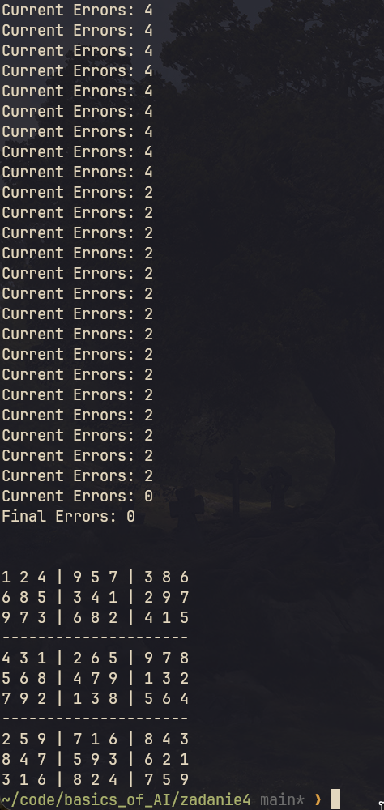

| Podstawy sztucznej inteligencji | laboratorium |
|---------------------------------|--------------|
| SAN                             |              |
| Autor                           | Yaroslav Zubakha |
| E-mail                          | 121546@student.san.edu.pl / yar.zubaha@proton.me |
| Nr albumu                       | 121546       |
| Data                            | 21.12.2024   |
| Wersja                          | 1.0          |

 

# **Zadanie nr 4**

 

> ## Opis zadania
- Obliczyć, za pomocą algorytmu symulowanego wyżarzania wybrane zagadnienie: rozwiązywanie Sudoku.
    - Dane wejściowe i opis zadania.
    - Poprawne wyniki obliczeń.
    - Przebieg obliczeń lub algorytm w wybranym języku.

 

> ## Kod algorytmu
Znajduje się w pliku `./121546_PSI_zadanie4.py`

 

> ## Przebieg obliczeń i wyniki

W ramach zadania, użyto algorytmu symulowanego wyżarzania do rozwiązywania łamigłówki Sudoku. Oto kluczowe elementy:

1. **Opis Problemu**:
    - **Sudoku** to łamigłówka, w której należy uzupełnić 9x9 siatkę cyframi od 1 do 9, aby w każdym wierszu, kolumnie i bloku 3x3 nie powtarzały się liczby.

2. **Dane wejściowe**:
    - Plansza Sudoku podana w postaci tekstowej, z pustymi komórkami oznaczonymi jako `0`.

3. **Przebieg algorytmu**:
    - Początkowe wartości są losowo uzupełniane w blokach 3x3.
    - Algorytm iteracyjnie optymalizuje planszę, minimalizując liczbę błędów w wierszach, kolumnach i blokach.
    - Przyjmuje gorsze rozwiązania z prawdopodobieństwem zależnym od temperatury, co pozwala unikać lokalnych minimów.
    - Temperatura obniża się w czasie, co redukuje eksplorację na rzecz eksploatacji.

4. **Wyniki**:
    - Algorytm poprawnie rozwiązuje planszę Sudoku.
    - Liczba błędów (naruszeń zasad Sudoku) redukowana do zera.

### Przykładowe Wyjście Programu

<table>
  <tr>
    <td>
      
    </td>
    <td>
      <pre>
        Current Errors: 2
        Current Errors: 2
        Current Errors: 2
        Current Errors: 2
        Current Errors: 2
        Current Errors: 2
        Current Errors: 2
        Current Errors: 2
        Current Errors: 2
        Current Errors: 2
        Current Errors: 2
        Current Errors: 2
        Current Errors: 0
        Final Errors: 0

        1 2 4 | 9 5 7 | 3 8 6 
        6 8 5 | 3 4 1 | 2 9 7 
        9 7 3 | 6 8 2 | 4 1 5 
        ---------------------
        4 3 1 | 2 6 5 | 9 7 8 
        5 6 8 | 4 7 9 | 1 3 2 
        7 9 2 | 1 3 8 | 5 6 4 
        ---------------------
        2 5 9 | 7 1 6 | 8 4 3 
        8 4 7 | 5 9 3 | 6 2 1 
        3 1 6 | 8 2 4 | 7 5 9 
done
      </pre>
    </td>
  </tr>
</table>
