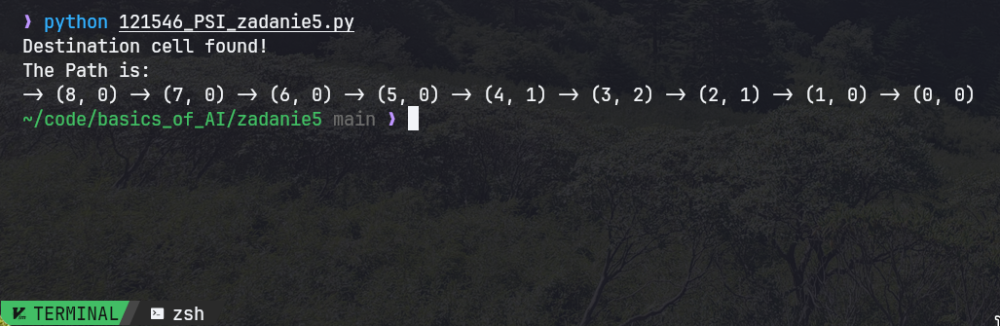

<div align="center">

| Podstawy sztucznej inteligencji | laboratorium |
|---------------------------------|--------------|
| SAN                             |              |
| Autor                           | Yaroslav Zubakha |
| E-mail                          | 121546@student.san.edu.pl / yar.zubaha@proton.me |
| Nr albumu                       | 121546       |
| Data                            | 16.01.2025   |
| Wersja                          | 1.0          |

<br>

# **Zadanie nr 5**

</div>

<br>

> ## Opis zadania
- Obliczyć, za pomocą algorytmu A* najkrótszą ścieżkę w wybranym grafie.
    - Dane wejściowe i opis zadania.
    - Poprawne wyniki obliczeń.
    - Graf z minimum 10 węzłami.

<br>

> ## Kod algorytmu
Znajduje się w pliku `./121546_PSI_zadanie5.py`

<br>

> ## Przebieg obliczeń i wyniki

W ramach zadania, użyto algorytmu A* do znalezienia najkrótszej ścieżki w grafie reprezentowanym jako siatka 9x10. Oto kluczowe elementy:

### Opis Problem
- **Cel:** Znalezienie najkrótszej ścieżki pomiędzy dwoma punktami na siatce.
- **Dane wejściowe:**
  - Siatka 9x10, gdzie `1` oznacza pole dostępne, a `0` oznacza przeszkodę.
  - Punkt startowy: dolny-lewy róg siatki (`[8, 0]`).
  - Punkt końcowy: górny-lewy róg siatki (`[0, 0]`).

### Przebieg Algorytmu
1. **Inicjalizacja:**
   - Lista zamknięta do przechowywania odwiedzonych węzłów.
   - Lista otwarta, priorytetowa kolejka węzłów do odwiedzenia.
   - Detale komórek zawierające koszty `f_cost`, `g_cost`, `h_cost` oraz wskaźnik na rodzica.

2. **Funkcja Heurystyczna:**
   - Odległość euklidesowa: h = sqrt((x_dest - x)^2 + (y_dest - y)^2).

3. **Algorytm:**
   - Początek od komórki startowej (`[8, 0]`) z kosztami zainicjalizowanymi jako 0.
   - Rozważanie sąsiadów dla każdej odwiedzanej komórki z uwzględnieniem:
     - Czy sąsiad nie jest przeszkodą.
     - Czy sąsiad nie został odwiedzony wcześniej.
     - Aktualizacja kosztów jeśli nowa ścieżka jest korzystniejsza.
   - Kontynuacja aż do znalezienia punktu docelowego.

4. **Wynik:**
   - Najkrótsza ścieżka wyznaczona i wyświetlona jako sekwencja współrzędnych.
    

### Wyniki
- Siatka (9x10) zapewnia minimalne wymaganie grafu z 10 węzłami.
- Algorytm skutecznie oblicza najkrótszą ścieżkę.
- Przykładowy wynik:
    ```
    Destination cell found!
    The Path is:
    -> (8, 0) -> (7, 0) -> (6, 0) -> (5, 0) -> (4, 1) -> (3, 2) -> (2, 1) -> (1, 0) -> (0, 0) 
    ```

### Wyjaśnienie Wyników
- **Koszty:**
  - `g_cost`: rzeczywisty koszt przejścia z punktu startowego do bieżącego.
  - `h_cost`: heurystyczny koszt przejścia z bieżącego punktu do celu.
  - `f_cost`: suma `g_cost` i `h_cost`.
- **Priorytety:** Komórki z najniższym `f_cost` są przetwarzane jako pierwsze, co gwarantuje efektywne znajdowanie ścieżki.
