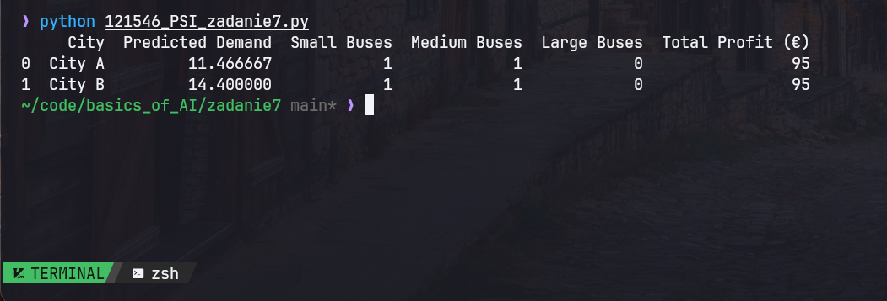

<div align="center">

| Podstawy sztucznej inteligencji | laboratorium                                     |
| ------------------------------- | ------------------------------------------------ |
| SAN                             |                                                  |
| Autor                           | Yaroslav Zubakha                                 |
| E-mail                          | 121546@student.san.edu.pl / yar.zubaha@proton.me |
| Nr albumu                       | 121546                                           |
| Data                            | 15.12.2025                                       |
| Wersja                          | 1.0                                              |

<br>

# **Zadanie nr 7**

</div>

<br>

> ## Opis zadania

- Oszacować zapotrzebowanie na transport do 2 miast
- Zoptymalizować wykorzystanie posiadanej floty pojazdów, w celu maksymalizacji zysku.

Na ocenę 5 praca powinna zawierać:

- Poprawne wyniki obliczeń.
- Min. 3 wartości, na podstawie których dokonywana jest KAŻDA prognoza zapotrzebowania.
- Min. 3 pojazdy.
- Wynik optymalizacji.

<br>

> ## Solution

### 1. Predykcja zapotrzebowania na transport

Wykorzystano metodę **najmniejszych kwadratów (KMNK)** do prognozy zapotrzebowania na transport na podstawie historycznych danych dla dwóch miast. Implementacja oparta jest na macierzowej wersji KMNK.

**Dane wejściowe**:

- 10-letnie dane historyczne dotyczące zapotrzebowania na transport
- Rok prognozy: 2024

**Obliczenia**:

- Konstruujemy macierz wejściową X.
- Obliczamy współczynniki regresji liniowej.
- Prognozujemy zapotrzebowanie na 2024 rok.

**Przykładowy wynik**:
| City | Predicted Demand |
|--------|-----------------|
| City A | 11.47 |
| City B | 14.40 |

<br>

### 2. Optymalizacja wykorzystania floty

W celu maksymalizacji zysku przeprowadzono optymalizację przydziału pojazdów dla przewidywanego popytu.

**Typy pojazdów**:
| Vehicle Type | Capacity (Passengers) | Cost per Trip (€) | Revenue per Passenger (€) |
|-------------|----------------------|------------------|-------------------------|
| Small Bus | 5 | 50 | 15 |
| Medium Bus | 10 | 80 | 15 |
| Large Bus | 20 | 120 | 15 |

**Metoda optymalizacji**:

- Najpierw przypisujemy duże autobusy, aby zminimalizować liczbę pojazdów.
- Dostosowujemy flotę, aby uwzględnić pozostałe zapotrzebowanie.
- Obliczamy całkowity koszt, przychody i zysk.

**Wyniki optymalizacji**:
| City | Small Buses | Medium Buses | Large Buses | Total Profit (€) |
|--------|------------|--------------|-------------|------------------|
| City A | 1 | 1 | 0 | 95 |
| City B | 1 | 1 | 0 | 95 |

<br>

> ## Implementacja w Pythonie

Cała analiza została zaimplementowana w pliku **121546_PSI_zadanie7.py**, który zawiera:

- **Regresję liniową KMNK** do prognozy zapotrzebowania
- **Optymalizację floty** w celu maksymalizacji zysków
- **Wyświetlanie wyników** w postaci tabelarycznej

### **Uruchomienie kodu**

```bash
python 121546_PSI_zadanie7.py
```

Wyniki zostaną wyświetlone w terminalu w formie tabelarycznej.


